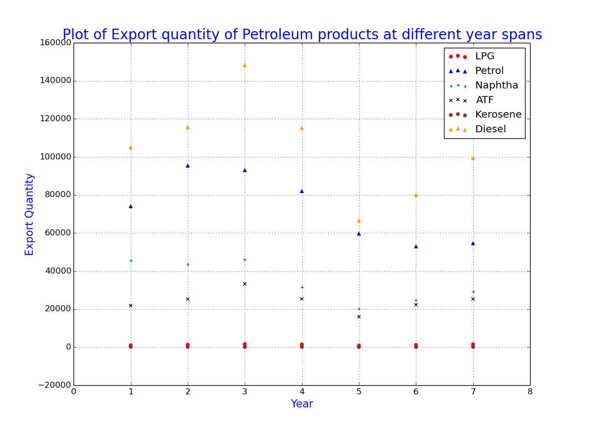
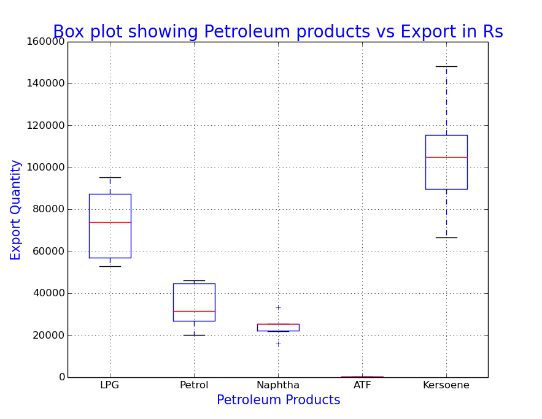
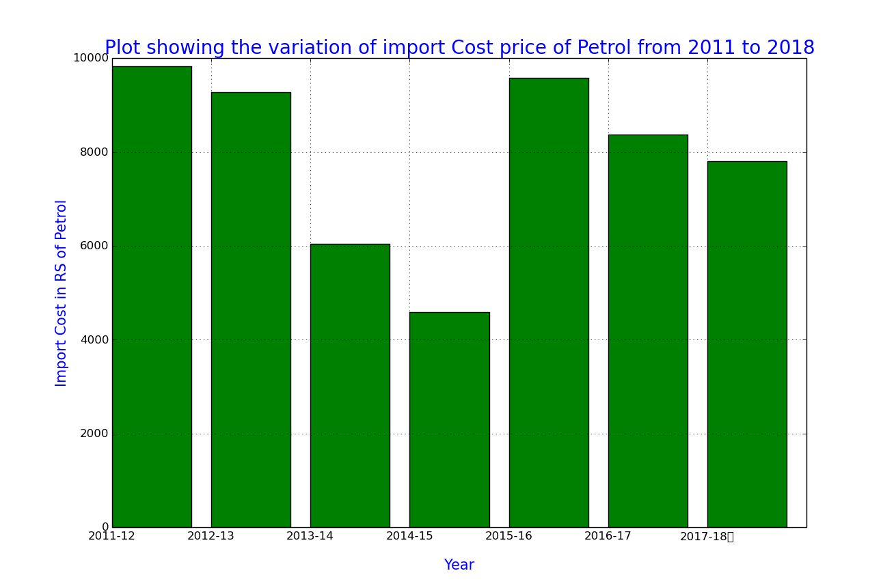

# DS200 - Research Methods

This repository is dedicated to the Module 4 of the DS200.

# Plotting with MatPlotLib in Python
### Name : Abhishek P
### Roll No :  17560

The following data has been obtained from "https://data.gov.in" and plotted using matplotlib. 

## Data:- Import/Export of Crude Oil and Petroleum Products (in Rs. Value Terms) from 2011-12 to 2017-18

**a. Scatter Plot** 
**Observation:** The scatter plot attached shows how the Export Quantity price of various Petroleum Products is varying over the years.

**b. Box Plot**
Box plot showing Petroleum products on x axis and Export Rs Value Terms on y axis
**Observation:** The Box plot attached shows the individual price distribution of the different petroleum products over the years. It can be observed that for Naphtha and ATF values remain almost the same over the years. Huge variation of price Quantity exported happened in the case of Kerosene and Petrol.

**c.Bar Plot**
The variation of import Cost price of Petrol from 2011 to 2018 
**Observation:** Bar plot attached shows the variation of the Import price Quantity price of Petrol over the years. It can be observed that the Import price Quantity of petrol was highest in the year 2011-12 and from there it dropped in the subsequent years to second lowest value in seven years.

## Acknowledgments

1. Data Sources: <https://data.gov.in>
2. https://matplotlib.org/
